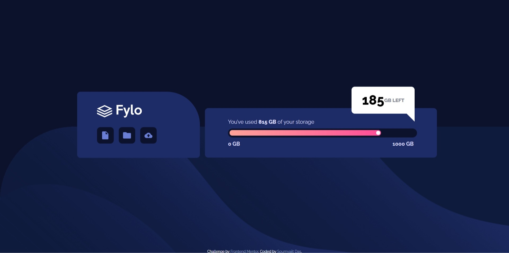

# Frontend Mentor - Fylo data storage component solution

This is a solution to the [Fylo data storage component challenge on Frontend Mentor](https://www.frontendmentor.io/challenges/fylo-data-storage-component-1dZPRbV5n). Frontend Mentor challenges help you improve your coding skills by building realistic projects. 

## Table of contents

- [Overview](#overview)
  - [The challenge](#the-challenge)
  - [Screenshot](#screenshot)
  - [Links](#links)
- [My process](#my-process)
  - [Built with](#built-with)
  - [What I learned](#what-i-learned)
- [Author](#author)


**Note: Delete this note and update the table of contents based on what sections you keep.**

## Overview

### The challenge

Users should be able to:

- View the optimal layout for the site depending on their device's screen size

### Screenshot




### Links

- Solution URL: [Click Here](https://github.com/Soumyajit2000-web/frontendmentorchallenges/tree/main/fylo-data-storage-component-master)
- Live Site URL: [Add live site URL here](https://your-live-site-url.com)

## My process

### Built with

- Semantic HTML5 markup
- CSS custom properties
- Flexbox
- CSS Grid
- Mobile-first workflow


### What I learned

I learned the used of pseudo classes to style tooltips.

This is my solution to styling the tooltip:

```html
<div class="hover">
    <span>185 </span> GB Left
</div>
```
```css
.hover::after{
        content: " ";
        position: absolute;
        top: 100%;
        left: 100%;
        margin-left: -24px;
        border-width: 12px;
        border-style: solid;
        border-color: white white #ffffff00 transparent;
    }
```


## Author

- Frontend Mentor - [@Soumyajit2000-web](https://www.frontendmentor.io/profile/Soumyajit2000-web)


